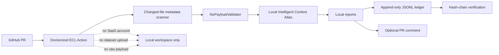

# Enterprise Security Review Packet

## Review Summary

ECL Learning Ledger is a local-first training-data governance layer. It produces metadata-only CI artifacts for LLM development teams and does not require a SaaS account, hosted database, dataset upload, raw payload inspection, or repository-code execution.

## No-Payload Policy

The invariant is simple: every event, report, PR comment, card export, envelope, and transport path must pass `NoPayloadValidator` before append, render, serialization, signing, or submission.

Blocked classes include raw text, prompts, completions, messages, dataset rows, token sequences, embeddings, model weights, checkpoint bytes, notebook cells, raw diffs, local absolute paths, and secrets.

Allowed classes include SHA-256 hashes, source-root descriptors, schema fingerprints, token-count estimates, aggregate ratios, controlled tags, license descriptors, provenance descriptors, lineage IDs, evaluation deltas, and risk flags.

Primary reference: `docs/NO_PAYLOAD_POLICY.md`.

## Red-Team Corpus Summary

The adversarial corpus is intentionally metadata-only. It tests that disguised payloads and unsafe metadata shapes fail closed without embedding sensitive examples.

Current fixture families:

- Payload-key smuggling: `raw_preview_text`, `fulltext`, `embeddingvec`.
- Benchmark alias overlap: benchmark aliases that should trigger contamination risk.
- Lineage feedback loop: self-referential lineage IDs.
- Domain crossing: financial manifest carrying healthcare compliance tags.
- Invalid hashes: malformed hash values and schema identifiers.
- Oversized URI metadata: abusive query strings disguised as links.
- Safe controls: known-good financial metadata.

Review command:

```bash
ecl-trainer red-team-corpus
```

Expected result: every unsafe fixture is rejected or flagged, and every safe control passes.

## Hash-Chain Explanation

The local ledger is append-only JSONL. Each event is canonicalized, hashed, and chained to the prior event hash.

Verification produces:

- `valid`: whether every link verifies.
- `event_count`: number of ledger rows inspected.
- `first_broken_link`: first index that fails, or `null`.
- `last_event_hash_sha256`: final ledger hash.

Tamper behavior:

- Editing an earlier line changes that line's self hash.
- Removing a line breaks the next event's previous-hash pointer.
- Reordering lines breaks continuity.
- A failed append from payload validation leaves the ledger unchanged.

## Supply-Chain Evidence

The local artifact generator writes supply-chain evidence under `.ecl-trainer/reports/supply-chain/`.

Expected files:

- `supply-chain-sbom.json`
- `supply-chain-provenance.json`
- `supply-chain-manifest.json`

The RC gate should also run:

- `ruff`
- `mypy`
- `pyright`
- `bandit`
- `pip-audit`
- `python -m build`
- Docker build and smoke run

## Dependency Audit Notes

`pip-audit` should be run with the package installed in a clean environment. Editable local packages may be skipped when the objective is third-party dependency vulnerability detection.

Known policy:

- A third-party critical or high vulnerability blocks release unless documented as unreachable or patched.
- A medium vulnerability requires owner acknowledgement.
- A low vulnerability can ship with backlog tracking.
- The audit output must not include secrets or local payload material.

## Local-Only Architecture



## Audit Questions And Answers

| Question | Answer |
| --- | --- |
| Does the action upload datasets? | No. It reads metadata and writes local artifacts. |
| Does it execute repository code? | No. The CI path is static scanning and local report generation. |
| Can it run without SaaS credentials? | Yes. SaaS submission is optional and not part of the default path. |
| What happens on a payload violation? | The scan fails closed before ledger append or artifact rendering. |
| Are private Atlas rows exposed? | No. Public outputs show aggregate counts and findings, not private rows. |
| Can auditors verify tampering? | Yes. `verification.json` and hash chaining expose broken continuity. |

## Buyer-Ready Security Folder Checklist

- No-Payload Policy: `docs/NO_PAYLOAD_POLICY.md`
- Red-team summary: this packet and `RED_TEAM_AUDIT.md`
- Hash-chain proof: `examples/proof_artifact_gallery/verification.json`
- Supply-chain evidence docs: `docs/SUPPLY_CHAIN_EVIDENCE.md`
- Local-only GitHub Action docs: `docs/GITHUB_ACTION.md`
- Artifact examples: `examples/proof_artifact_gallery/`
